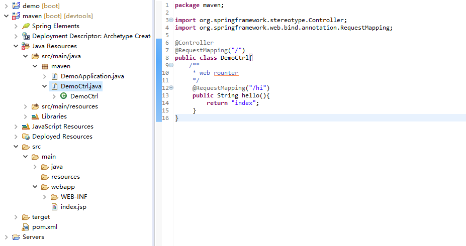

### maven创建spring boot

[参考：maven环境搭建](http://www.cnblogs.com/wenziii/p/6075929.html)

[参考：使用Eclipse插件创建Java WebApp项目](http://www.cnblogs.com/wenziii/p/6075929.html)

**一、创建项目**

1、创建maven project

2、选择“maven-archetype-webapp”（不要勾选第一项 “Create a simple project”）

3、填写项目相关信息，Finish。

4、修改JRE版本。

```java
<build>
  <plugins>
  <plugin>
  <groupId>org.apache.maven.plugins</groupId>
  <artifactId>maven-compiler-plugin</artifactId>
  <version>2.1</version>
  <configuration>
  <source>1.7</source>
  <target>1.7</target>
  </configuration>
  </plugin>
  </plugins>
</build>
```

设置完后，选中项目右击，弹出的菜单中选择 Maven->Update Project .

5、修改错误信息

更新之后，发现项目还存在错误。

在项目根目录右击弹出菜单，选择 Build Path ->Configure Buile Path，进入项目的 Java build path 配置页面：



这时只要将 Libraries 标签中的 JRE System Library (双击)设置为本机默认的(workspace default JRE)就可以解决该错误

6、添加服务器运行环境（Java Application）

在 Eclipse 中对项目设置一下运行主函数就可以了。

切换到 Libraries 标签，点击“Add Library”按钮。

**二、连接mysql**

```java

<parent>
  <groupId>org.springframework.boot</groupId>
  <artifactId>spring-boot-starter-parent</artifactId>
  <version>1.4.3.RELEASE</version>
</parent>


<dependency>
    <groupId>org.springframework.boot</groupId>
    <artifactId>spring-boot-starter-web</artifactId>
</dependency>
<dependency>
    <groupId>org.springframework.boot</groupId>
    <artifactId>spring-boot-starter-data-jpa</artifactId>
</dependency>
<dependency>
    <groupId>mysql</groupId>
    <artifactId>mysql-connector-java</artifactId>
    <scope>runtime</scope>
</dependency>
<dependency>
    <groupId>org.springframework.boot</groupId>
    <artifactId>spring-boot-starter-test</artifactId>
    <scope>test</scope>
</dependency>


<properties>
	<project.build.sourceEncoding>UTF-8</project.build.sourceEncoding>
	<java.version>1.8</java.version>
	<springBoot.groupId>org.springframework.boot</springBoot.groupId>
</properties>


<build>
    <plugins>
        <plugin>
            <groupId>org.springframework.boot</groupId>
            <artifactId>spring-boot-maven-plugin</artifactId>
        </plugin>
    </plugins>
</build>

```

src/main/resources/application.properties

```java
spring.jpa.hibernate.ddl-auto=create
spring.datasource.url=jdbc:mysql://localhost:3306/db_example
spring.datasource.username=springuser
spring.datasource.password=ThePassword
```

主函数入口

```java
package com.spring;
import org.springframework.boot.CommandLineRunner;
import org.springframework.boot.SpringApplication;
import org.springframework.boot.autoconfigure.SpringBootApplication;
import org.springframework.context.annotation.Bean;
import com.spring.controller.User;
import com.spring.controller.UserRepository;
@SpringBootApplication
public class AppleApplication {
    public static void main(String[] args) {
        SpringApplication.run(AppleApplication.class, args);
    }
    @Bean
	public CommandLineRunner demo(UserRepository repository) {
		return (args) -> {
			repository.save(new User(1, "Bauer"));
		};
	} 
}

package com.spring.controller;
import org.springframework.stereotype.Controller;
import org.springframework.web.bind.annotation.RequestMapping;
@Controller
public class Controller2 {
	@RequestMapping("/hi")
	public String hi() {
		return "index.html";
	}
}

package com.spring.controller;
import org.springframework.web.bind.annotation.RequestMapping;
import org.springframework.web.bind.annotation.RestController;
@RestController
public class Controller1 {
	@RequestMapping("/login")
	public String login() {
		return "login";
	}
}

package com.spring.controller;
import javax.persistence.Entity;
import javax.persistence.GeneratedValue;
import javax.persistence.GenerationType;
import javax.persistence.Id;
@Entity 
public class User {
    @Id
    @GeneratedValue(strategy=GenerationType.AUTO)
    private Integer id;
    private String name;
    public User() {};
    public User(int i, String string) {};
	public Integer getId() {
		return id;
	}
	public void setId(Integer id) {
		this.id = id;
	}
	public String getName() {
		return name;
	}
	public void setName(String name) {
		this.name = name;
	}
}

package com.spring.controller;
import org.springframework.data.repository.CrudRepository;
public interface UserRepository extends CrudRepository<User, Long> {}

```

[参考:accessing-data-mysql](https://spring.io/guides/gs/accessing-data-mysql/)

[参考:accessing-data-jpa](http://spring.io/guides/gs/accessing-data-jpa/)

**三、请求解析**

html 测试

```html
<!DOCTYPE html>
<html>
<head>
<meta charset="UTF-8">
<title>index</title>

<script src="https://cdnjs.cloudflare.com/ajax/libs/jquery/1.10.2/jquery.js"></script>

</head>
<body>

<script type="text/javascript">
	$(function(){
		$.ajax({
			method: "GET",
			url: "http://localhost:8080/login",
			data: '{"name": "zhansan","age": "12"}',
			contentType: "application/json",
			dataType: "json",
			success: function(res){
				console.log(res);
			},
			error: function(error){
				console.log(error);
			}
		})
	});
</script>

</body>
</html>
```

javabean

```java

// javabean

// @Entity注释指名这是一个实体Bean
@Entity
/**
* @Table注释指定了Entity所要映射带数据库表
* 其中name用来指定映射表的表名。
* 如果缺省@Table注释，系统默认采用类名作为映射表的表名
*/
@Table(name = "tbl_user", schema = "SIMULATE" )

public class User implements Serializable {

    // @Id注释指定表的主键，
    // 1、TABLE：容器指定用底层的数据表确保唯一；
    // 2、SEQUENCE：使用数据库德SEQUENCE列莱保证唯一（Oracle数据库通过序列来生成唯一ID）；
    // 3、IDENTITY：使用数据库的IDENTITY列莱保证唯一；
    // 4、AUTO：由容器挑选一个合适的方式来保证唯一；
    // 5、NONE：容器不负责主键的生成，由程序来完成。
    // @GeneratedValue注释定义了标识字段生成方式
    @Id
    @GeneratedValue(strategy = GenerationType.AUTO)
    private Integer id;

    // @Temporal注释用来指定java.util.Date或java.util.Calender属性
    // 与数据库类型date、time或timestamp中的那一种类型进行映射。
    @Temporal(value=TemporalType.TIME)
    private Date birthday;

    // @Column注释定义了将成员属性映射到关系表中的哪一列和该列的结构信息
    // 1、name：映射的列名。如：映射tbl_user表的name列，可以在name属性的上面或getName方法上面加入；
    // 2、unique：是否唯一；
    // 3、nullable：是否允许为空；
    // 4、length：对于字符型列，length属性指定列的最大字符长度；
    // 5、insertable：是否允许插入；
    // 6、updatetable：是否允许更新；
    // 7、columnDefinition：定义建表时创建此列的DDL；
    // 8、secondaryTable：从表名。如果此列不建在主表上（默认是主表），该属性定义该列所在从表的名字。

    @Column(name = "name")
    private String name;

    @Column(name = "age")
    private String age;

}
```

@ResponseBody
```
@ResponseBody是作用在方法上的，
@ResponseBody 表示该方法的返回结果直接写入 HTTP response body 中，
一般在异步获取数据时使用【也就是AJAX】，
在使用 @RequestMapping后，返回值通常解析为跳转路径，
但是加上 @ResponseBody 后返回结果不会被解析为跳转路径，
而是直接写入 HTTP response body 中。 
比如异步获取 json 数据，加上 @ResponseBody 后，会直接返回 json 数据。
@RequestBody 将 HTTP 请求正文插入方法中，
使用适合的 HttpMessageConverter 将请求体写入某个对象。
```

@RequestBody
```
@RequestBody是作用在形参列表上，
用于将前台发送过来固定格式的数据【xml 格式或者 json等】封装为对应的 JavaBean 对象，
封装时使用到的一个对象是系统默认配置的 HttpMessageConverter进行解析，
然后封装到形参上。
```

```java
<!-- 阿里的json工具包 -->
<dependency>
	<groupId>com.alibaba</groupId>
	<artifactId>fastjson</artifactId>
	<version>1.2.7</version>
</dependency>
```

```java
@Autowired
private UserRepository userRepository;

@RequestMapping("/login")
@ResponseBody
public List<User> login(@RequestBody JSONObject object) {
    System.out.println(jsonObject);

    List<User> user1= (List<User>) userRepository.findById((Integer) object.get("id"));

    return user1;
}
// post请求 将Content-Type转换成json 
// contentType: "application/json; charset=utf-8"
```

```java
public interface UserRepository extends CrudRepository<User, Integer> {
    List<User> findById(Integer id);

   	// @Query(value = "select u.* from user u where u.id = ?1", nativeQuery = true)
	// @Modifying
	// List<User> findByUserId(Integer id);

}
```

**四、获取参数的几种常用注解**

```
@PathVariable : 用来获得请求url中的动态参数的 
                如：@RequestMapping("/zyh/{type}") zyh(@PathVariable(value = "type") int type)

@RequestParam : 该注解来获取多个参数,一般在PUT，POST中比较常用。
                如：x(@RequestParam String signature, @RequestParam String timestamp)

@RequestBody : 该注解和@RequestParam一样，也是目前我使用到最多的注解来获取参数
                如：createUserByMap(@RequestBody Map<String,Object> reqMap)
```

**五、redis**

[windows下安装redis](https://blog.csdn.net/jinwufeiyang/article/details/52156817/)

```java
// pom.xml
<dependency>
    <groupId>org.springframework.boot</groupId>
    <artifactId>spring-boot-starter-data-redis</artifactId>
</dependency>

// redis 配置 application.properties
spring.redis.host=127.0.0.1
# Redis服务器连接端口
spring.redis.port=6379
# Redis服务器连接密码（默认为空）
spring.redis.password=
# 连接池最大连接数（使用负值表示没有限制）
spring.redis.pool.max-active=8
# 连接池最大阻塞等待时间（使用负值表示没有限制）
spring.redis.pool.max-wait=-1
# 连接池中的最大空闲连接
spring.redis.pool.max-idle=8
# 连接池中的最小空闲连接
spring.redis.pool.min-idle=0
# 连接超时时间（毫秒）
spring.redis.timeout=30000

```


